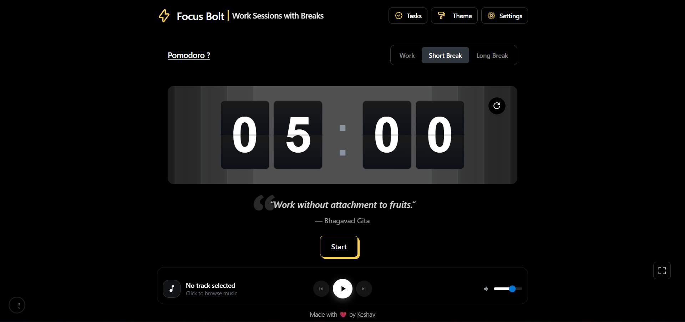

# ⚡ Focus Bolt

A beautiful Pomodoro timer that helps you stay focused and productive. Built with React and Tailwind CSS, Focus Bolt combines elegant design with powerful features to make time management effortless.

**Live Demo:** [focusbolt.vercel.app](https://focusbolt.keshavcodes.in/)



## ✨ Features

**Smart Timer System**
- Customizable focus and break sessions
- Visual flip-clock animation for a satisfying countdown experience
- Desktop notifications to alert you when sessions end
- Persistent progress tracking using local storage

**Personalization**
- Multiple theme options (light, dark, gradient themes)
- Integrated music player with play/pause controls
- Custom background images for break screens
- Motivational messages to keep you going

**Progress Tracking**
- Track your completed sessions
- Monitor your productivity over time
- All data saved locally in your browser

## 🚀 Getting Started

### Prerequisites
- Node.js installed on your machine
- A modern web browser

### Installation

1. Clone the repository
```bash
git clone https://github.com/keshav-builds/FocusBolt.git
cd focus-bolt
```

2. Install dependencies
```bash
npm install
```

3. Run the development server
```bash
npm run dev
```

4. Open [http://localhost:3000](http://localhost:3000) in your browser

## 🎯 How to Use

1. **Set Your Timer** - Choose your focus duration (default is 25 minutes)
2. **Start Focusing** - Hit the start button and get to work
3. **Take Breaks** - Enjoy your break when the timer goes off
4. **Track Progress** - Watch your productivity grow over time

## 🛠️ Built With

- **Next.js** - React framework
- **Tailwind CSS** - Styling
- **Local Storage** - Data persistence


## 💡 Feedback

Found a bug or have a feature request? Feel free to open an issue or reach out!

---

**Happy focusing! ⚡**
